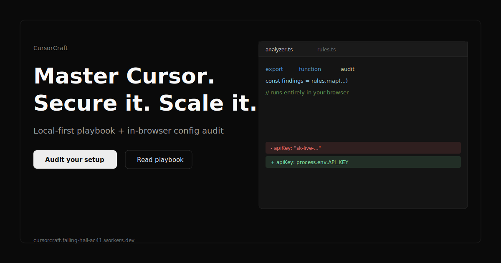

# CursorCraft

**Master Cursor. Secure it. Scale it.** — an unofficial, open-source community guide to using the [Cursor](https://cursor.com) AI code editor securely and cost-effectively, plus free, fully client-side tools.

**Live site:** [https://cursorcraft.falling-hall-ac41.workers.dev/](https://cursorcraft.falling-hall-ac41.workers.dev/)

> Local-first · Your code & keys never leave your browser · Open source

---

## The problem

Cursor is easy to adopt and easy to misuse. Secrets get pasted into prompts, context gets sprayed at expensive models, and MCP servers run with far more privilege than they need. The fixes are well understood but scattered across docs, blog posts, and tribal knowledge.

## The solution

CursorCraft collects the practices that make AI-assisted development **fast, safe, and affordable** into one credible playbook — six senior-level guides — and pairs it with **twelve local-first tools**:

### The playbook

Six guides: mental model, feature tour, best practices, **security**, **cost optimization**, and **enterprise rollout**. Optional **guide progress** tracking (opt-in `localStorage` on `/learn`).

### Tools (100% client-side)

| Tool | Path |
| --- | --- |
| Config Analyzer | `/tools/config-analyzer` |
| Rules Generator | `/tools/rules-generator` |
| Rules Templates | `/tools/rules-templates` |
| Rules & Hooks Linter | `/tools/rules-linter` |
| Policy Pack (zip) | `/tools/policy-pack` |
| MCP Scope Visualizer | `/tools/mcp-visualizer` |
| .cursorignore Diff | `/tools/cursorignore-diff` |
| Cost Estimator | `/tools/cost-estimator` |
| Pre-commit Snippet | `/tools/precommit-snippet` |
| Security Checklist | `/tools/security-checklist` |
| Usage Insights | `/tools/usage-insights` |

Also: **⌘K / Ctrl+K search** across guides, tools, and pages · **PWA** offline shell · **light/dark theme** (persisted locally).

### Screenshots




_Press `⌘K` (or `Ctrl+K`) on the live site to search guides and tools._

---

## Local-first security promise

CursorCraft practices the security it teaches:

- **No backend secret handling.** The site is statically generated; there is no server that receives or stores your config, keys, or code.
- **No telemetry on your code or keys.** Nothing you paste in tools is transmitted, logged, or analyzed remotely.
- **Tool inputs are in-memory only** — they disappear when you close the tab. Never written to `localStorage` for file contents or keys.
- **Opt-in persistence only** for guide reading progress and theme preference — never for config you paste.
- **Verifiable.** Open the network tab while you run an audit; go offline with the PWA shell. Read the source.

The repository **dogfoods** the advice: strong [`.cursorignore`](./.cursorignore), [`.cursor/rules`](./.cursor/rules/cursorcraft.mdc), and a CI config audit via [`scripts/audit-cursor-config.mts`](./scripts/audit-cursor-config.mts).

---

## Built in Cursor

This project was, fittingly, **built in Cursor** — spec-first prompts, small reviewed diffs, conventions encoded as rules, and a curated `.cursorignore`.

---

## Tech stack

- **[Astro](https://astro.build)** 7 (`output: 'static'`) · **TypeScript (strict)**
- **Tailwind CSS v4** · **React** islands for interactive tools only
- **MDX** content collections · **Shiki** highlighting
- Self-hosted **Geist** / **Geist Mono** fonts
- SEO: meta, OG/Twitter, JSON-LD, sitemap, RSS, neutral OG PNGs
- CI: `astro check`, unit tests, build, config audit (see [`.github/workflows/ci.yml`](./.github/workflows/ci.yml))

---

## Local development

Requires Node 18+ (developed on Node 22).

```bash
npm install
npm run dev          # http://localhost:4321
npm run build        # static output → ./dist
npm run preview      # preview production build
npm run check        # astro + TypeScript check
npm test             # analyzer, MCP, diff, estimate, lint tests
npm run audit:config # audit .cursor files in this repo
```

---

## Deploying to Cloudflare

CursorCraft is fully static — **no adapter needed**. Production:

**https://cursorcraft.falling-hall-ac41.workers.dev/**

### Cloudflare Pages (Git-connected)

1. Connect this repo in **Workers & Pages → Create → Pages**.
2. Build settings:
   - **Framework preset:** Astro
   - **Build command:** `npm run build`
   - **Build output directory:** `dist`
3. Deploy from `main`.

Update the production URL in `astro.config.mjs`, `src/config/site.ts`, and `public/robots.txt` if your hostname differs.

---

## Project structure

```
src/
  components/        UI, Header/Footer, React tool islands
  content/guides/    MDX playbook
  layouts/           BaseLayout (SEO, PWA, theme)
  lib/               analyzer, search, cost-estimator, mcp-visualizer, …
  pages/             routes + /tools/*
public/              fonts, manifest, service worker
scripts/             audit-cursor-config.mts (CLI + CI)
.github/             CI workflow + cursor-config-audit action
```

---

## Contributing

Corrections, sharper guidance, and new **local-first** tool ideas are welcome. Security and content accuracy come first. See [SECURITY.md](./SECURITY.md) for vulnerability reports.

---

## Disclaimer

CursorCraft is an **independent, community-run project**. It is **not affiliated with, endorsed by, or sponsored by Anysphere** (the makers of Cursor). "Cursor" and related marks belong to their respective owners.

## License

[MIT](./LICENSE) © The CursorCraft community
